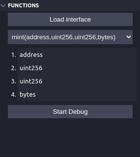
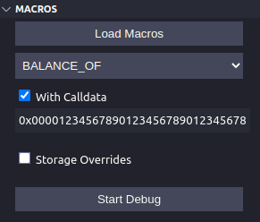

# VSCode Huff

**NOTE: Debugger requires path installations of [huffc](https://github.com/huff-language/huff-rs) and [hevm](https://github.com/dapphub/dapptools/tree/master/src/hevm) from [dapptools](https://github.com/dapphub/dapptools) before use.**

Features at a glances: 
- Advanced language support
- Syntax Highlighting
- Hover cards detailing gas usage
- Code Generation

## Hevm Powered Debugging
Step through execution of your contracts from external calls, or even individual macros. Manipulate the stack inputs when your macro starts and even override storage slots. Star power your productivity. 
This is particularly useful for debugging your macros individually. For more e2e debugging, the foundry debugger is an excellent tool.

**How it works:**
Open up any .huff file and press `Load Interface` to prepare external functions, enter in your calldata parameters and hit debug to get started.  



The example above is for an erc721 mint function, entering from the function debugger will allow you to step through execution from the MAIN entrypoint. To select another function, click the drop down and select another function! The drop down will be populated with functions that are defined at the top of the file that you are currently debugging.

**Notice - *Relevant to WSL users***
To get the extension to run in wsl there is a workaround that you will have to make. Unfortunately, vscode extensions do not run in the same environment as your wsl shell so do not have access to the same path (even when mounted with wsl-remote). If the extension detects that you are working in a remote code space it will attempt to execute huffc and hevm within the wsl shell. The wsl api does not run the ~/.bashrc script (the file which huffup adds to the path), therefore to use this extension in wsl you will have to copy the following into your ~/.profile. 
```
if [ -d  "$HOME/.huff/bin" ]; then
    PATH="$HOME/.huff/bin:$PATH"
fi
```
We will look to address this limitation in further releases of huffup.


### Macro Debugging
Macro debugging is the tool's most useful feature. Clicking `Load Macros` will load the macros of the currently open file.
If the macro has no `takes` arguments then the window will look like this:





You can choose to add arbitrary hex `calldata` to the debugger instance by selecting the `With Calldata` checkbox. 

#### Defining `takes` parameters:


If the selected macro has `takes(n)` then n windows will appear to allow setting of the stack before execution.

#### Overriding storage:


`Storage Overrides` allows you to test your macro with arbitrary overrides for specified storage slots! To use, select the `Storage Overrides` checkbox, then add as many slots as you require. Upon execution, the slots will be set to the values that you have defined. You can quickly toggle this feature off by unselecting the `Storage Overrides` checkbox.

## Code Generation
**Switch table generation**  
Generate the MAIN macro switch table with jumps from just the interface definition. No more visiting keccak online or using `cast sig xxx` to copy function selectors into your code. Just write the interface and let us handle the rest.

Usage:
    `commandPallete -> Huff: Generate MAIN() Switch Table`

**Event signature generation**
Similarly to switch table generation above. Forget about calculating the keccak of you event topics yourself. 

Usage:
    `commandPallete -> Huff: Generate interface signature from interface`

## Hover Cards
Hovering the cursor over an opcode will explain what operation it performs, the minimum amount of gas it uses, as well as a link to evm.codes to read more about it. 

## Currently not supported
[] Constructor Arguments.
